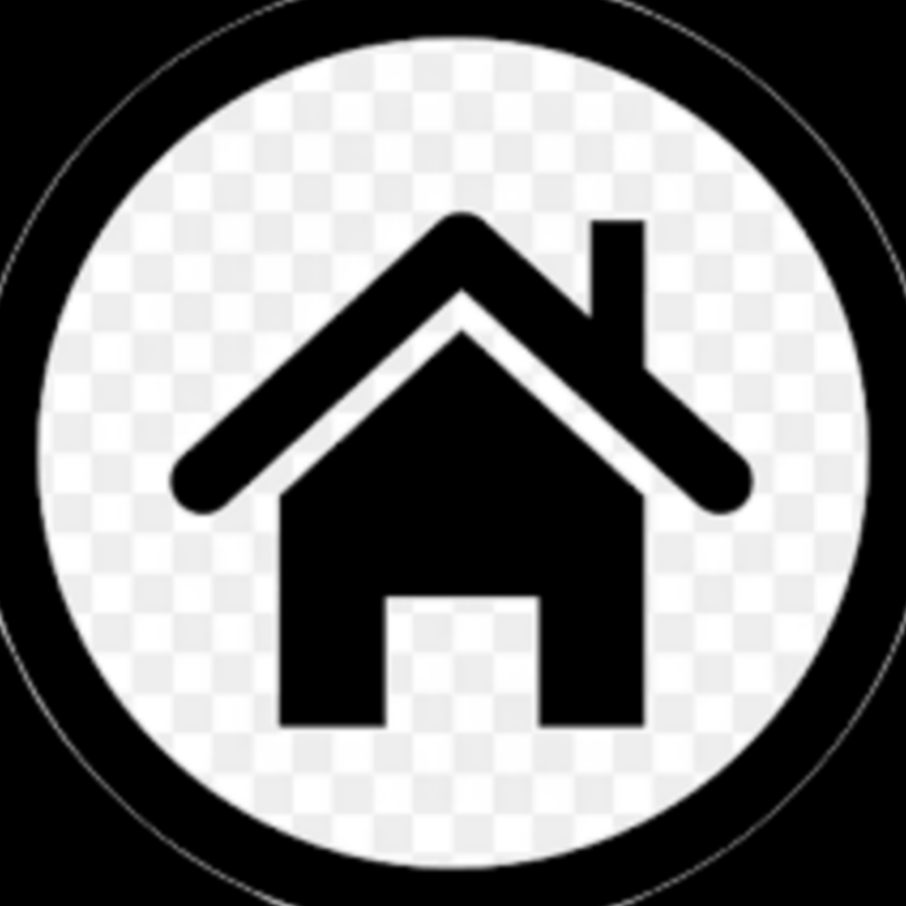

<html>
  <head>
    <ul>
      <li><h3>file name: index.js</h3></li>
        <li><h3>beor run you bot must you change"TOKEN" with you bot token</h3></li>
        <li><h3>Must you use this cod"npm install discord.js@12" to run your bot</h3></li>
    </ul>
  </head>
  
        <body>
<h3>project file</h3>
<a href="limnk"><h3>download projject file</h3></a>
          <h2>
            PROJECT:</h2>
          <table>
            <tr>
              <td>
                const Discord = require('discord.js');
const client = new Discord.Client();
const prefix = '!';

client.once('ready', () => {
    console.log('Bot is online!');
});

client.on('message', message => {
    if (!message.content.startsWith(prefix) || message.author.bot) return;

    const args = message.content.slice(prefix.length).trim().split(' ');
    const command = args.shift().toLowerCase();

    if (command === 'openticket') {
        const ticketChannel = message.guild.channels.cache.find(channel => channel.name === 'tickets');
        if (!ticketChannel) return message.channel.send('لا يمكن العثور على القناة!');

        ticketChannel.send('تذكرة جديدة تم فتحها!');
    }
});

client.login('YOUR_BOT_TOKEN');
              </td>
            </tr>
          </table>
          
          
          
        </body>
          </html>
